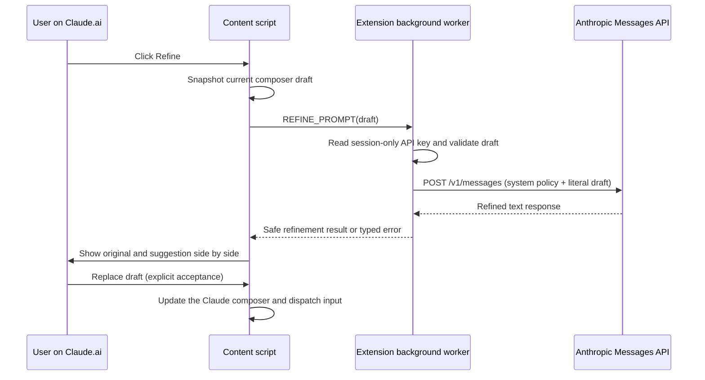

# Prompt Refiner: design, research, and evaluation plan

**Status:** implemented for review and manual API-key validation  
**Decision date:** 2026-09-11  
**Scope:** the prompt currently being drafted in the Claude.ai composer

## Decision summary

The feature must perform semantic prompt refinement, not text normalization. The
chosen design is an explicit, user-authorized call from the extension background
worker to Anthropic's supported Messages API, followed by a side-by-side review
and an explicit **Replace draft** action.

This replaces the previous two-path design:

- a local path that chiefly removed filler and whitespace; and
- a "Deep" path that depended on private Claude.ai conversation endpoints and
  created a hidden conversation.

Neither satisfies the product requirement reliably. The local path was not
genuine refinement, while the private-endpoint path was coupled to undocumented
web-app behavior and could fail when Claude.ai changed. The old floating UI also
registered listeners before its async settings code created the controls, which
could leave the feature inert.

## What counts as prompt refinement

A result is a refinement only when it makes the task easier for Claude to
execute without changing what the person means. It may be longer. In particular,
it should make useful parts of the following explicit when the draft supports
them:

- the requested task and relevant context;
- constraints, safety boundaries, and non-goals;
- intended audience, tone, and language;
- desired deliverable, format, and success criteria; and
- ordered steps or preserved source material such as code, URLs, filenames,
  identifiers, examples, and numbers.

It must not invent facts, requirements, files, tools, preferences, or acceptance
criteria. If the draft is materially ambiguous, it should preserve that
uncertainty as a compact placeholder or question rather than silently deciding
for the user.

This follows Anthropic's guidance to make instructions and desired output
explicit, add relevant context, and retain useful structure such as numbered
steps and bullets. [Prompting best practices](https://platform.claude.com/docs/en/build-with-claude/prompt-engineering/claude-prompting-best-practices)

## Options considered

| Option | Quality | Reliability | Privacy / trust | Decision |
| --- | --- | --- | --- | --- |
| Local regex cleanup | Cannot infer missing task structure or intent | High | No outbound data | Rejected: it is not semantic refinement. |
| Private Claude.ai conversation API | Can produce a rewrite | Low: undocumented endpoints, session/auth coupling, hidden conversations | Surprising and hard to audit | Rejected. |
| Official API with the user's key, from the background worker | Strong semantic rewrite with an explicit contract | High: documented endpoint and typed failures | Draft leaves the browser only after a click; key remains out of page context | Chosen. |
| Extension-owned proxy | Could hide key setup and centralize model policy | Requires a production service, billing, retention policy, abuse controls, and consent surface | Introduces a new data processor | Deferred until there is an explicit server product. |

The official API is a REST API at `https://api.anthropic.com`; its Messages API
accepts `POST /v1/messages`, a top-level `system` prompt, input messages, and a
bounded `max_tokens` value. It requires authentication plus `anthropic-version`
and JSON content headers. [API overview](https://platform.claude.com/docs/en/api/overview)
[Create a Message](https://platform.claude.com/docs/en/api/messages/create)

## Implemented architecture

### Components

| Component | Responsibility |
| --- | --- |
| `src/content-script/composer-refiner.ts` | Finds the live Claude composer, injects one **✦ Refine** control, presents review/error dialogs, and changes the draft only after acceptance. It re-injects after Claude's SPA swaps the composer. |
| `src/background/prompt-refiner.ts` | Holds the official API request, key handling, timeout, bounds checks, response validation, and safe error translation. |
| `src/refiner.ts` | Provides network-free contracts: prompt policy, literal draft envelope, response extraction, and UI size estimates. |
| `src/background/init.ts` | Authorizes messages by sender: refinement only from this extension's Claude.ai content script; key mutation only from this extension's options page. |
| Options page | Lets the user enable/disable the feature and save or clear an API key for the current browser session. |

### Request policy

The system instruction tells Claude to preserve intent and intentional structure,
clarify the work and output contract, avoid inventing information, and return
only the ready-to-send prompt. The draft is sent as literal data after a
one-way marker, rather than in a closing XML block that a draft could escape.
The system instruction remains authoritative even if the draft contains
adversarial text.

The implementation pins `claude-haiku-4-5-20251001` for a fast interactive
rewrite. Anthropic's current model comparison lists that snapshot as Haiku 4.5,
the fastest option in the lineup, with a 200K-token context window and a 64K
maximum output. The snapshot should be periodically re-evaluated against the
evaluation set below rather than treated as permanently optimal. [Models overview](https://platform.claude.com/docs/en/models/overview)

### Privacy and security boundaries

- No request occurs while the user types. The only egress is after a click on
  **✦ Refine**.
- The API key is held only in `chrome.storage.session`, not normal extension
  settings. It is not returned to a content script or injected into Claude.ai,
  and it disappears when the browser session ends.
- The background worker uses the key only for `https://api.anthropic.com/v1/messages`.
  It does not create, delete, or send hidden Claude.ai chats.
- The original and refined draft are rendered with `textContent`, not injected
  as HTML.
- A failed, malformed, empty, or truncated API response never replaces the
  composer. The original draft remains in place.
- Remote error bodies and API-key values are not surfaced to the page or logged
  by the feature.

### Failure behavior

| Condition | User-facing behavior | Draft behavior |
| --- | --- | --- |
| No key configured | Explain how to open settings | Unchanged |
| Empty / too-large draft | Explain why no call was made | Unchanged |
| Invalid key / rate limit / timeout / network failure | Show a safe retryable error | Unchanged |
| Non-text or max-token-truncated output | Reject it as unusable | Unchanged |
| Draft edited while a request is in flight | Require a second, explicit **Replace anyway** click | Never overwritten accidentally |

There is deliberately no local-cleanup fallback: substituting a superficial
rewrite after an AI failure would violate the feature's meaning and make the
failure misleading.

## Evaluation and experiment plan

The implementation tests request mechanics; it cannot prove semantic quality by
itself. Before changing the policy or model, evaluate candidates on a small,
consented, de-identified fixture set rather than on production prompts.

### Hypotheses

1. The semantic policy improves task clarity and output specification more often
   than a no-refinement baseline without reducing factual fidelity.
2. Review-before-replace prevents harmful changes even when the model makes an
   imperfect assumption.
3. A fast model is acceptable for the common short composer draft; longer or
   technical drafts may justify an optional higher-quality model later.

### Fixture strata

- terse requests with a clear implied deliverable;
- coding requests containing filenames, code fences, commands, and acceptance
  criteria;
- research, planning, writing, and multilingual drafts;
- drafts with intentionally incomplete information;
- adversarial or instruction-like text inside the draft; and
- already well-structured prompts, which should stay nearly unchanged.

### Blind scoring rubric

Have at least two reviewers compare the original and refined prompt without
knowing which policy produced it. Score each 1–5 and record disagreements:

| Dimension | Pass condition |
| --- | --- |
| Intent fidelity | Goal, facts, constraints, examples, language, and tone remain intact. |
| Actionability | A capable collaborator can identify the task and next deliverable. |
| Output contract | Format, level of detail, and success criteria are explicit when supported by the draft. |
| Structure preservation | Code, URLs, identifiers, numbers, and intentional bullets survive exactly where needed. |
| Non-invention | No unsupported details or false certainty appear. |
| Style fit | The rewrite remains natural for the user's intended use. |

The primary quality gate is an improvement in actionability and output-contract
scores with no material decrease in fidelity or non-invention. Do not use
acceptance rate alone as a quality metric: it is affected by UI placement,
latency, price, and user habits.

### Operational measures

Measure only through a separately consented evaluation build or manual test
session; the shipped extension should not add prompt-content telemetry.

- request-to-review latency (p50/p95);
- successful response and safe-failure rates;
- rejection rate for truncation or malformed output;
- explicit accept, discard, and edit-before-accept outcomes; and
- API cost per accepted refinement, using provider billing rather than prompt
  logging.

### Experiment sequence

1. Establish the baseline using the current system policy and model snapshot.
2. Compare one variable at a time: policy wording, maximum output allowance, or
   model—not all at once.
3. Run the blind rubric on the same fixtures and inspect every fidelity failure.
4. Promote a candidate only if it meets the quality gate and does not create a
   worse latency/cost trade-off for normal drafts.
5. Keep the current review gate and safe-failure behavior in every variant.

## Verification completed in the repository

- Unit tests cover session-only key handling, missing/blank/oversized prompts,
  the official endpoint and headers, response parsing, truncation rejection,
  safe errors, and a DOM-level review-before-replace flow.
- The full test suite passes with 216 tests, and TypeScript type-checking passes.
- A live request has intentionally not been made without a user-provided API key.
  Manual validation should use a disposable or appropriately scoped key and
  inspect the network panel to confirm one official Messages request occurs only
  after clicking **✦ Refine**.

## Follow-up decisions

- Revisit the pinned model snapshot when Anthropic updates availability or the
  evaluation results show a material quality gap.
- If product requirements later prohibit user-managed API keys, design an
  explicit proxy service separately; do not smuggle it into the extension.
- Add opt-in, local-only evaluation fixtures before changing the system policy.
- Consider a model-quality selector only after testing whether it improves the
  rubric enough to justify the added choice and cost surface.
